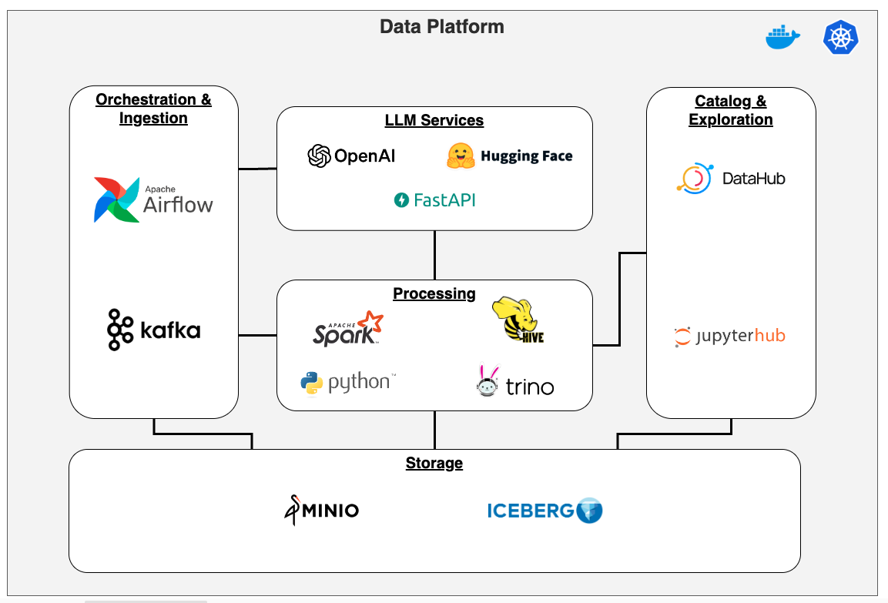

# Data Platform 

## Introduction

The goal of this project is to provide a local development environment for Data Engineers & Scientists to easily experiement with new tools and use cases. Many of the tools in the project are pre-configured to work with each other, minimizing the effort needed to get started. 

### The use case
We'll ingest a small dataset from Kaggle and process it with our platform. See more details [here](/UseCase.md)


## Prerequisites

Before you start, ensure your host system (MacOS) has the following software installed:

- **Docker**: A platform for developing, shipping, and running applications inside isolated environments called containers.
- **Kind (Kubernetes in Docker)**: A tool for running local Kubernetes clusters using Docker container nodes.
- **Helm**: A package manager for Kubernetes, allowing you to define, install, and upgrade complex Kubernetes applications.
- **Python 3.8 or higher**: A powerful programming language, essential for running scripts and additional tools in this project.
- **Pip**: A package installer for Python, used to install Python packages.

### Install Commands for MacOS

1. **Install Docker:**

   ```bash
   brew cask install docker
   ```
2. **Install kubectl**
   ```bash
   brew install kubectl
   ```
2. **Install Kind:**

   ```bash
   brew install kind
   ```

3. **Install Helm:**

   ```bash
   brew install helm
   ```

4. **Install Python 3.8+:**

   ```bash
   brew install python@3.8
   ```

   Or setup a virtual environment for this project

5. **Install Pip:**

   Pip is included with Python 3.4 and later. You can ensure it's up to date with:

   ```bash
   python3 -m pip install --upgrade pip
   ```

## Quick Start

1. **Clone the Repository**
   
   ```bash
   git clone https://github.com/msantana09/data_platform.git
   cd data_platform
   ```

2. **Initialize .env files**

   The project comes with several template files (e.g. .env-template) containing the default credentials and configurations for for the various services.  The command below copies the default template files to .env files, which are ignored by git. You can then modify the .env files as needed.

   ````bash
   ./platform.sh init
   ````
3. **Install project dependencies (Optional)**

   If you plan on doing any development you'll want to install these project dependencies.
   ```
   pip install -r requirements-dev.txt
   ```

4. **Configure use case credentials (Optional)**

   If you're planning on running the sample use case you'll need to configure your Kaggle and OpenAI credentials

   - **Kaggle**: Update `AIRFLOW_CONN_KAGGLE_DEFAULT` in file `services/airflow/.env` with your [Kaggle](https://www.kaggle.com/) username and key
   - **OpenAI**: Update `OPENAI_API_KEY` in file `services/models/.env` with your [OpenAI](https://openai.com/)  key


5. **Launch the Platform**

   Use the `-h` flag to see all options:
   ````bash
   (.venv) ➜  data_platform git:(main) ✗ ./platform.sh -h
   Usage: ./platform.sh <action> [-c|--cluster <cluster_name>] [-d|--delete-data] [sub_scripts...]

   Options:
   <action>                      The action to perform (init|start|shutdown|recreate)
   -c, --cluster <cluster_name>  Set the cluster name (default: platform)
   -d, --delete-data             Delete data flag (default: false)
   -h, --help                    Display this help message
   [sub_scripts...]              Additional scripts to run (default: core). 
                                 Valid names include: 
                                    airflow, datahub, hive, jupyter, minio, models, trino, spark, superset,
                                    lakehouse ( minio, hive, trino ),
                                    core ( lakehouse + airflow + spark + kafka )
   ````
   Here are a few examples:
   ```bash
   # start airflow and MinIO
   ./platform.sh start airflow minio

   # start all the services for the use case:
   # core ( lakehouse ( minio, hive, trino ) + airflow + spark + kafka )
   # models
   ./platform.sh start core models

   # shutdown only MinIO
   ./platform.sh shutdown minio

   # shutdown only Minio and delete persisted data (blank slate)
   ./platform.sh shutdown minio -d

   # shutdown the entire cluster
   ./platform shutdown

   # shutdown the entire cluster, and delete persisted data for all services
   ./platform shutdown -d
   ```

## Architecture



This version makes uses a *mostly* open stack comprised of:

<table>
    <tr>
        <th style="width:20%">Tool</th>
        <th style="width:50%">Description</th>
        <th style="width:30%">URLs</th>
    </tr>
    <tr>
        <td><a href="https://min.io/">MinIO</a></td>
        <td>An object storage solution that provides an S3-like experience, but with your data staying local.</td>
        <td><a href="http://localhost:9001/">http://localhost:9001/</a> (UI) <br> <a href="http://localhost:9000/">http://localhost:9000/</a> (API) <br> minio:minio123</td>
    </tr>
    <tr>
        <td><a href="https://airflow.apache.org/">Apache Airflow</a></td>
        <td>An orchestrator for our data pipelines</td>
        <td><a href="http://localhost:8081/">http://localhost:8081/</a> (UI)<br> airflow:airflow123</td>
    </tr>
    <tr>
        <td><a href="https://www.python.org/">Python</a></td>
        <td>Primary language used in data pipelines</td>
        <td></td>
    </tr>
    <tr>
        <td><a href="https://spark.apache.org/">Apache Spark</a></td>
        <td>Used to process ingested data (e.g. clean/transform tasks), and to analyze with SparkSQL</td>
        <td></td>
    </tr>
    <tr>
        <td><a href="https://trino.io/">Trino</a></td>
        <td>Distributed query engine enabling us to query files stored in S3/Minio using SQL</td>
        <td><a href="http://localhost:8082/">http://localhost:8082/</a> (for service/jdbc connections)<br><a href="http://localhost:8082/ui/">http://localhost:8082/ui/</a> (cluster overview UI)<br>Authentication not setup, just use 'trino' for username</td>
    </tr>
    <tr>
        <td><a href="https://cwiki.apache.org/confluence/display/hive/design">Apache Hive Metastore</a></td>
        <td>Hive acts as a central repository for metadata about our data lake. Our Spark jobs and Trino rely on Hive when querying or modifying tables.</td>
        <td><a href="http://localhost:8081/">http://localhost:8081/</a> (UI)<br> airflow:airflow123</td>
    </tr>
    <tr>
        <td><a href="https://iceberg.apache.org/">Apache Iceberg</a></td>
        <td>A table format utilized by our Spark jobs to enable data stored in S3 (Minio) to be querable through engines like Trino or SparkSQL.</td>
        <td></td>
    </tr>
    <tr>
        <td><a href="https://openai.com/">OpenAI GPT 3.5</a></td>
        <td>Used to generate descriptions for ingested columns. Selected for ease of use, but an OSS model like Mistral works just as well (you'll just need the hardware)</td>
        <td></td>
    </tr>
    <tr>
        <td><a href="https://datahubproject.io/">Datahub</a></td>
        <td>Serves as our metadata repository. GPT generated column descriptions, along wither technical metadata, would be visible in Datahub users interested in understanding their data and how it relates to other parts of their organization.</td>
      <td><a href="http://localhost:8084/">http://localhost:8084/</a> (UI)<br>datahub:datahub</td>
    </tr>
    <tr>
        <td><a href="https://jupyter.org/hub">JupyterHub</a></td>
        <td>Notebooks used test out ideas</td>
      <td><a href="http://localhost:8888/">http://localhost:8888/</a> (UI)</td>
    </tr>
    <tr>
        <td><a href="https://superset.apache.org/">Superset</a></td>
        <td>A visualization tool to create dashboards, graphics.  Not really used in this use case, but I included it since I already had it's yaml file downloaded.  Be aware those, it uses a lot of memory</td>
      <td><a href="http://localhost:8888/">http://localhost:8083/</a>(UI)<br/>admin:admin</td>
    </tr>
</table>


## Contributing

Guidelines for contributing to the project, including how to submit issues, the pull request process, and coding standards.

## License

Include details about the license under which the project is released.
