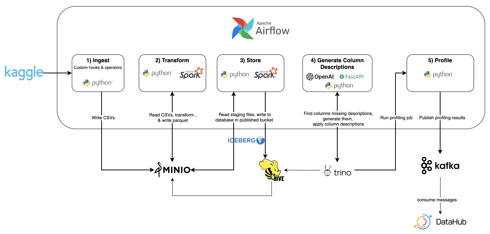
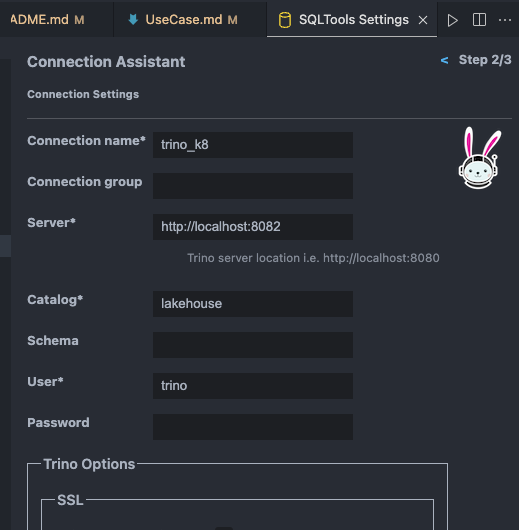

# Kaggle ETL Use Case

## Overview


This use case demonstrates how to ingest a dataset from Kaggle and process it using our platform. The steps involved are:

1. **Ingest Data**: Use custom Airflow operators and hooks to ingest CSV files into a raw bucket in Minio.
2. **Transform Data**: Run Spark jobs to clean and transform the columns.
3. **Store Data**: Write the output using the Apache Iceberg table format, with updated metadata written to the Hive metastore.
4. **Generate Column Descriptions**: Since the Kaggle dataset lacks column descriptions, we'll use GPT 3.5 to generate initial descriptions.
5. **Profile Data**: Run a Datahub CLI pipeline task to profile our tables through Trino and publish the results to a Kafka topic. After approximately 5 minutes, Datahub's metadata service will consume messages from the Kafka topic and present the profiling results in the Datahub UI.


### Resource Requirements
To ensure all services in the use case build and run successfully, allocate the following resources to Docker:
- **CPU**: At least 4 cores
- **Memory**: 16GB
- **Disk Space**: 20GB

For lower specifications (minimum 8GB memory needed), follow these steps:

1. **Start Core Services**:
    ```sh
    ./platform.sh start core models
    ```
    - Run the Airflow DAG (see steps 3 & 4 in the next section). It will complete successfully with just the `core` and `models` services running. Kafka utilizes a persistent volume, so messages will be available for Datahub to consume once it is started.

2. **Switch to Kafka and Datahub**:
    ```sh
    ./platform.sh shutdown core models && ./platform.sh start kafka datahub
    ```
    - This will shut down the services required to run the Airflow DAG and leave only Kafka and Datahub running (see step 5 in the next section).


## Steps
1. Configure use case credentials

    You'll need to update the .env files with valid credentials before starting. If you don't see an .env file, please see the initialization step in the [quick start](/README.md#quick-start)

   - **Kaggle**: Update `AIRFLOW_CONN_KAGGLE_DEFAULT` in file `services/airflow/.env` with your [Kaggle](https://www.kaggle.com/) username and key
   - **OpenAI**: Update `OPENAI_API_KEY` in file `services/models/.env` with your [OpenAI](https://openai.com/)  key

2. Start the needed services
    ````bash
        # start all the services for the use case (it'll take ~10mins for all services to start up) :
        # core ( lakehouse ( minio, hive, trino ) + airflow + spark + kafka )
        # models
        # datahub
        ./platform.sh start core models datahub
    ````

3. Go to [Airflow](http://localhost:8081/) and start the  [kaggle_airbnb](http://localhost:8081/dags/kaggle_airbnb/grid) pipeline.  It'll take 3-4 mins to complete
    


4. Verify tables have been created and the data is queryable by connecting to Trino using a SQL client. Here's an example of SQLTools client in VS Code:

    #### SQLTools connection settings
    

    #### SQLTools Browser Tree
    

5. Go to [Datahub](http://localhost:8084/) , and search for 'kaggle_airbnb'. You will see a few results, including this listings table with ingested metadata, showing the column descriptions generated by GPT 3.5. 
    - NOTE: You may want to wait 2-3mins after the Airflow job completes before searching Datahub, since there is a slight delay as Elasticsearch indices are rebuilt.  
    #### Datahub Dataset
    