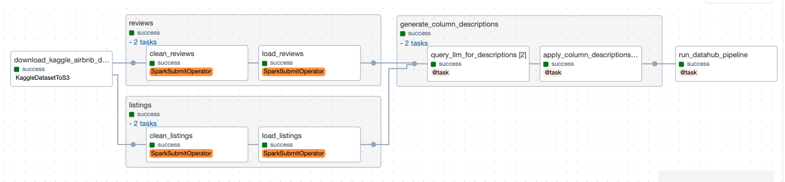

# Kaggle Ingestion Use Case

TODO

## Overview
We'll ingest a small dataset from Kaggle and process it with our platform:
- Use custom Airflow operators and hooks to ingest CSVs to a raw bucket in Minio
- Run Spark jobs to clean some of the columns, and write the output using the Apache Iceberg table format
- Since the Kaggle data set did not come with column descriptions, we'll share some details about the data set with GPT 3.5 and ask it to generate initial column descriptions for us 
- Run a Datahub CLI pipeline task which utilizes Trino to profile our tables, and publish results to a Kafka topic where it's consumed by the Datahub metadata service
- #TODO Language detection and sentiment analysis

## Steps
1. Start the needed services
    ````bash
        # start all the services for the use case (it'll take ~10mins for all services to start up) :
        # core ( lakehouse ( minio, hive, trino ) + airflow + spark + kafka )
        # models
        # datahub
        ./platform.sh start core models datahub
    ````

2. Go to [Airflow](http://localhost:8081/) and start the  [kaggle_airbnb](http://localhost:8081/dags/kaggle_airbnb/grid) pipeline.  It'll take 1-2 mins to complete
    


3. Verify tables have been created and the data is queryable by connecting to Trino using a SQL client. Here's an example of SQLTools client in VS Code:

    #### SQLTools connection settings
    

    #### SQLTools Browser Tree
    

4. Go to [Datahub](http://localhost:8084/) , and search for 'kaggle_airbnb'.  You see a few results, including this `listings` table with ingested metadata showing the GPT3.5 generate column descriptions

    #### Datahub Dataset
    